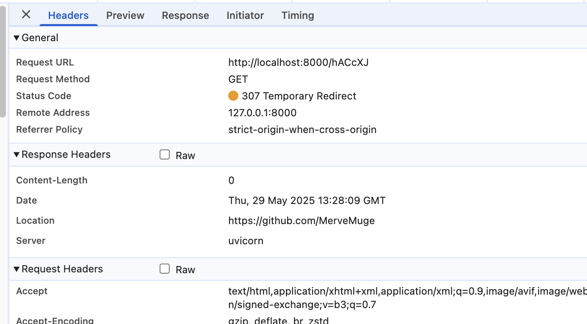

# url-shortener

## How to Run

```bash
   python3.13 -m uvicorn src.main:app --reload
```

## How to run test cases
```bash
  python3 -m pytest
```

## API Endpoints
API endpoints facilitate the communication between clients and servers.
A URL shortener primary needs two API endpoints.

### URL Shortening:
To create a new short URL, a client sends a POST request, which contains one parameter: the original long URL.
```
    curl -X 'POST' \
      'http://localhost:8000/shorten' \
      -H 'accept: application/json' \
      -H 'Content-Type: application/json' \
      -d '{
      "url": "https://github.com/MerveMuge"
    }'
```
Response body:
```
{
  "short_url": "http://localhost:8000/hACcXJ"
}
```

### URL Redirecting
To redirect short URL to the corresponding long URL, a client sends GET request.

Once the server receives a tinyurl request, it changes the sort URL to the long URL with 307 temporary redirect.



## Interactive API Docs
FastAPI auto-generates Swagger UI for easy exploration: http://localhost:8000/docs
