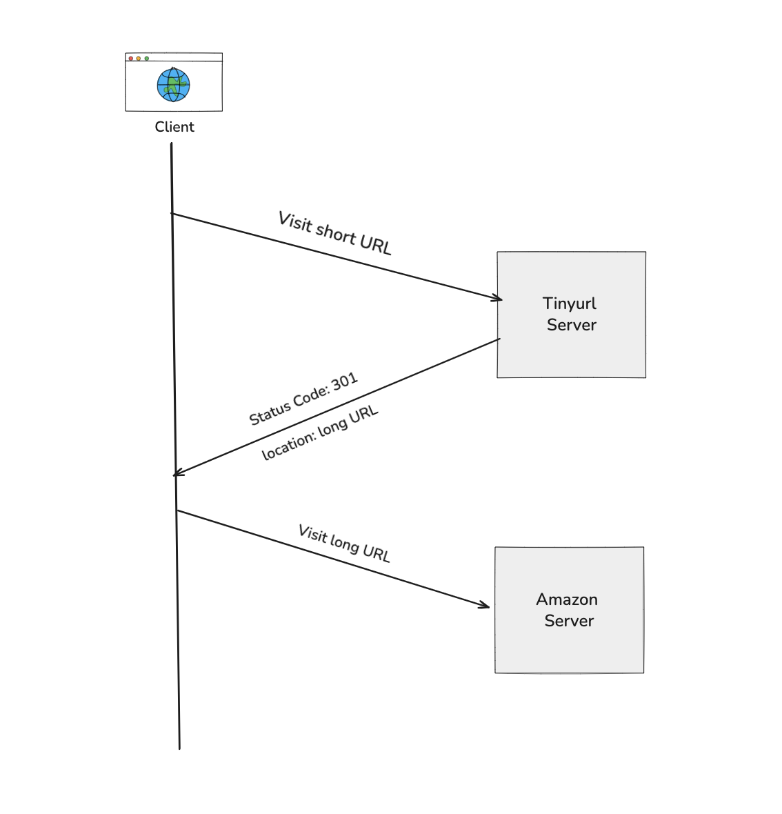

## Redirects

When building a URL shortener, redirect status codes determine how users and browsers are routed from the short URL to the original long URL.

### 301 Redirect (Moved Permanently)
A 301 redirect tells the browser that the short URL has permanently moved to a new location.

#### What happens behind the scenes?
The browser remembers this. 

It stores (caches) the redirect so the next time you visit the short link, it skips the shortener service and goes straight to the long URL.

#### Why use it?
It’s great when your shortened link will always point to the same destination, and you want to reduce the load on your shortening server.

#### Drawback?
Since the browser caches the redirect, any future updates to the long URL won’t take effect immediately, users may keep getting sent to the old destination.

### 307 Redirect (Temporary)
A 307 redirect also points the short URL to a new destination, but it tells the browser: “this is just a temporary move.”

#### What makes it different from 301?
The browser doesn’t cache it. Every time a user clicks the short URL, the request goes through your shortening server.

#### Why use it?
Perfect if you want to
- Track clicks (since your server is always involved)
- Change where the link goes in the future
- Preserve the original HTTP method (e.g., POST stays POST), which makes it safer for APIs and forms

#### Drawback?
Slightly more server load, since the shortening service handles every request.

