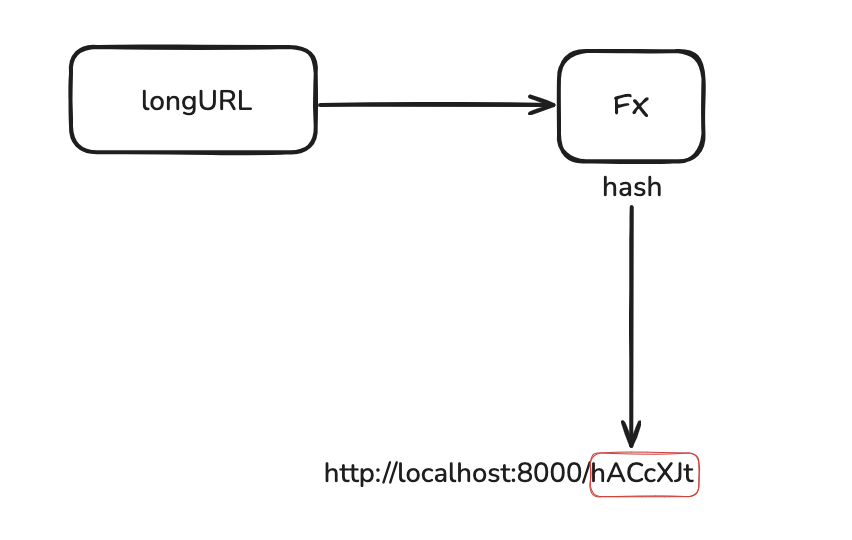
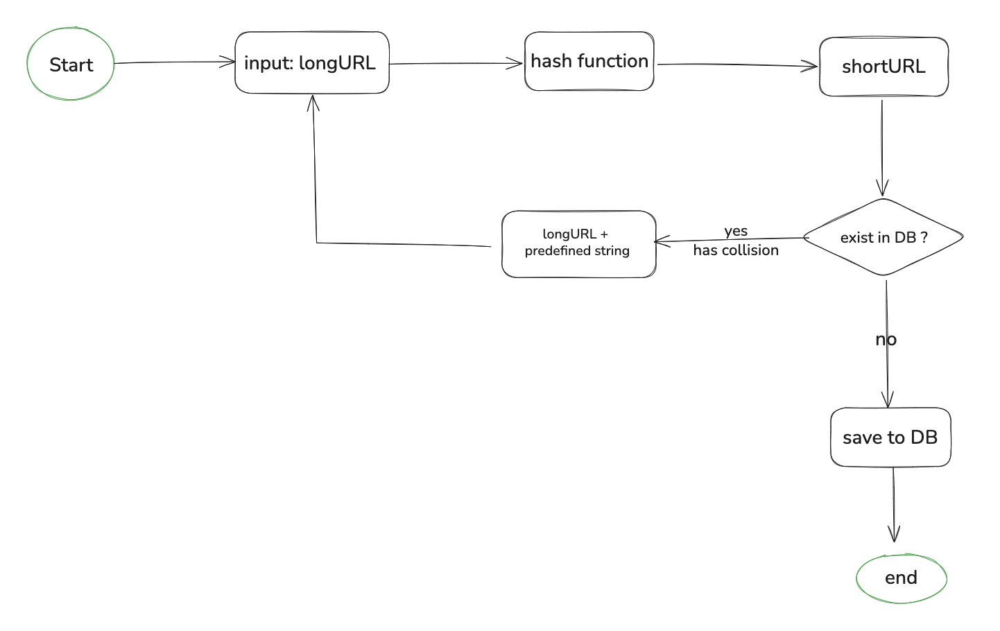
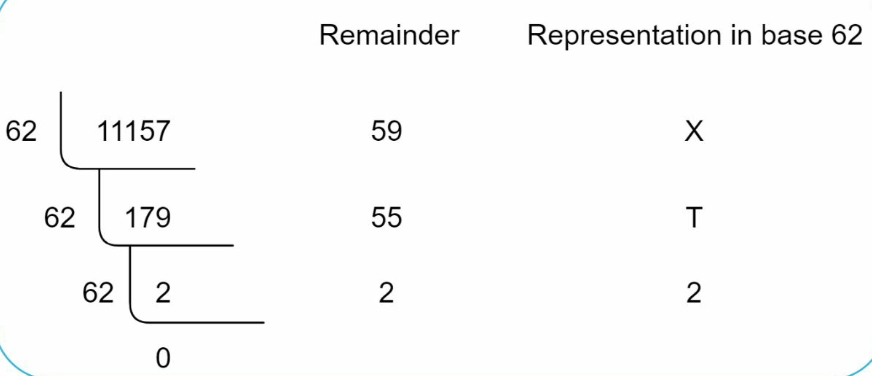
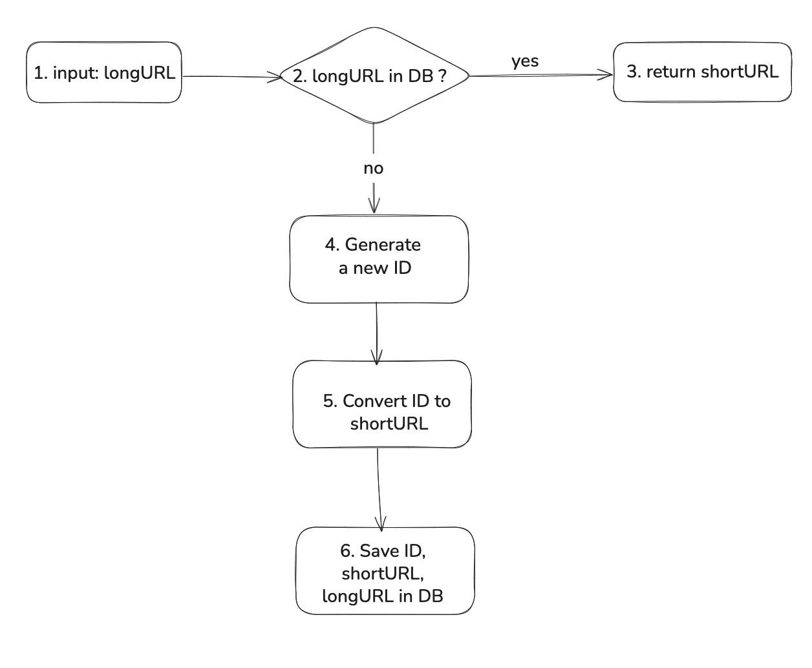
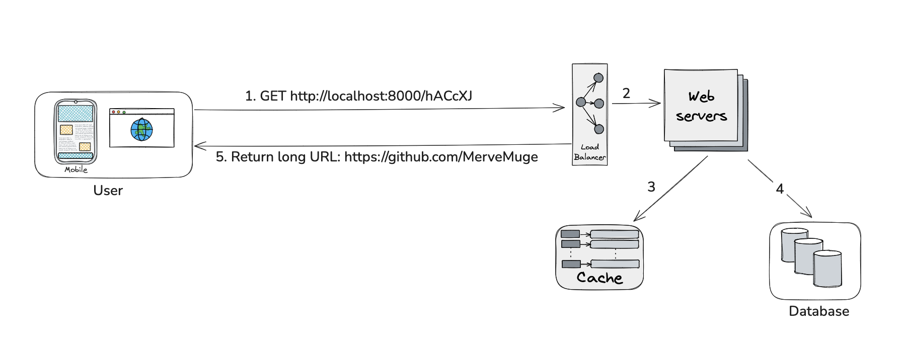

## Hash function
Hash function is used to hash a long URL to a short URL, also known as hashValue.



### Hash Function types:
#### 1. Hash + collision resolution 

To shorten a long URL, we should implement a hash function that hashes a long URL to a 7-
character string. A straightforward solution is to use well-known hash functions like CRC32,
MD5, or SHA-1. 

| Hash function |                      Hash value (Hexadecimal)                      | 
|:--------------|:------------------------------------------------------------------:| 
| CDR32         |                              5cb54054                              | 
| MD5           |           b272a310a23cd3cd3f6766aa1075ab6f                         |
| SHA1          |              c4f9c838a64f608552ea46ca44105d9e61d12025              |
   
      
As shown in the table even the shortest hash value (from CDC32) is too long (more than 7 characters)
How can we make it shorter?
The first approach is to collect the first 7 characters of a hash value; however, this method can lead to hash collisions.
To resolve hash collisions, we can recursively append a new predefined string until no more collsion is discovered.



This method can eliminate collsion; however,it is expensive to query the database to check if a shortURL exists for every request.

#### 2. Base 62 conversion

Base conversion helps to convert the same number between its different number representation systems. Base
62 conversion is used as there are 62 possible characters for hashValue.

example: (1115710 represents 11157 in a base 10 system)

• From its name, base 62 is a way of using 62 characters for encoding. The mappings are:
0-0, ..., 9-9, 10-a, 11-b, ..., 35-z, 36-A, ..., 61-Z, where ‘a’ stands for 10, ‘Z’ stands for 61, etc.



• 1115710 = 2 x 62^2 + 55 x 62^1 + 59 x 62^0 = [2, 55, 59] -> [2, T, X] in base 62

Thus, the short URL is https://localhost:8000/2TX

| Hash + collision resolution                                                                   |                                                      Base 62 conversion                                                      | 
|:----------------------------------------------------------------------------------------------|:----------------------------------------------------------------------------------------------------------------------------:| 
| Fixed short URL length                                                                        |                                  The short URL length is not fixed. It goes up with the ID.                                  | 
| It does not need a unique ID generator                                                        |                                        This option depends on a unique ID generator.                                         |
| Collision is possible and must be resolved                                                    |                                         Collision is impossible because ID is unique                                         |
| It is impossible to figure out the next available short URL because it does not depend on ID. | It is easy to figure out the next available short URL if ID increments by 1 for a new entry. This can be a security concern. |

#### 3. Random String Generation
Generate a random alphanumeric string of fixed length (e.g., 6–8 characters), check for uniqueness in the database.

#### 4. Salted Hash of URL
Hash the long URL along with a secret key or salt to avoid predictable outputs.

Example:
```
hashlib.sha256((url + secret_key).encode()).hexdigest()[:7]
```

### Deep dive

Assume base 62 conversion is used in our design.





1. A user clicks a short URL link.
2. The load balancer forwards the request to web servers.
3. If a shortURL is already in the cache, return the longURL directly.
4. If a shortURL is not in the cache, fetch the longURL from the databse. If it is not in the database, it is likely a user entered an invalid shortURL.
5. The longURL is returned.

### Improvements:
- Rate limiter: A potential security problem we could face is that malicious users send an overwhelmingly large number of URL shortening requests. 
        Rate limiter helps to filter out requests based on IP address or other filtering rules. 
- Web server scaling: Since the web tier is stateless, it is easy to scale the web tier by adding or removing web servers.
- Database scaling: Database replication and sharding are common techniques.
- Analytics: Data is increasingly important for business success. Integrating an analytics solution to the URL shortener could help to answer important questions like how many people click on a link? When do they click the link ? etc.
- Availability, consistency & reliability.


   
 